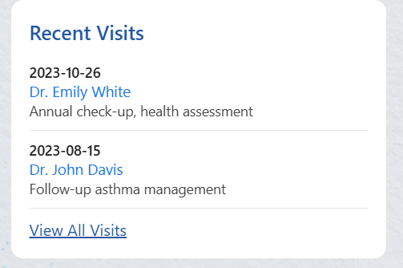

Add bottom navigation buttons → enable navigation between features

                                 ⬇️

Handwritten prescription → printed prescription (first usable version)

                                 ⬇️

Medicine shop map → filter highest → lowest discount → filter nearest → farthest

ui fixed -
- after upload successful no message to declare upload was successful.->the function is there but not working for some reason. dig into reddit,gihubt,yt to fix this bug. alert only appears in laptop view not mobile view.
- report display page has very bad ui.->fixed
- the uploading logic needs to be improved to allow MULTIPLE upload and pdf upload.
- make a separate profile access page so that users can access their own data without any scanning.->fixed

what is the utility of the scanner. if for some reason i cannot log into my account i can still access my records if the scanner is available.

date extraction pla:-
User selects image
↓
Frontend uploads image (temporary)
↓
Backend runs OCR + date extraction
↓
Backend returns:
  - suggestedDate
  - confidenceScore
↓
Frontend:
  - autofills date field
  - highlights it
  - allows edit
↓
User taps “Confirm & Save”
↓
Final submit (file + verified date)

file wise flow

patient.route.js
   ↓
patient.controller.js
   ↓
services/
   ├── imageDownloader.service.js
   ├── imagePreprocess.service.js
   ├── ocr.service.js
   ├── dateExtractor.service.js
   └── dateConfidence.service.js
   ↓
response to frontend

study about the optimization time complexity for sorting used.
the time taken to fetch data from db optimized or not

bug-
* user2@email.com is not a valid email but still the login worked although while retrieving data console printed patient not found
* for update profile page add drop down to - 1. gender 2. blood group ->fixed
* ui fix for reportpage display the ui is terrible ->fixed
* adjust medical record display to this ui  ->fixed
* add a delete button to delete any record
* report_name and prescription_name is mandatory. so jodi user name na enter kore by default report ba prescription naam chole jabe->by default newa r bapar ta hoche na
* mend the ui properly(upload prescription and report buttons)
* buttons at the bottom to navigate to different features->fixed but ui ta dekhte hobe

have to do-
* make a proper architecture

drawback of my pharmcy filtering:-
🚨 Hard truth first (no sugarcoating)
You CANNOT use Google Maps’ “nearest pharmacy” logic without using a Google Maps / Places API.
Why?
Google’s “nearest” is not just distance
It uses:
Road network distance (not straight-line)
Live traffic
Business relevance
Branch clustering
Popularity & activity
All of that logic is proprietary
It is only exposed via paid Google APIs
👉 There is no free endpoint, no URL trick, no embed hack that gives you:
“Give me the nearest branch exactly like Google Maps”
Opening Google Maps via link ≠ accessing Google’s ranking logic.

❌ What is NOT POSSIBLE (important, no false hope)
Goal	Possible?
Get Google/Bing pharmacy suggestions	❌
Use Google Maps ranking internally	❌
Scrape Google/Bing Maps	❌ (illegal + blocked)
Get full business list without API	❌

Even opening Google Maps with lat/lng:

❌ does not give you the list back

❌ does not expose suggestions programmatically

✅ What IS POSSIBLE (best realistic solution)

You need to change your mental model slightly.

🔁 Final correct model

Your app should NOT try to replace Google/Bing discovery
Your app should augment it.

file_url: "https://res.cloudinary.com/soumashree2004/image/private/s--qtGT8ZZK--/v1769893610/medical_records/nahp54ng9c1y12kxjhuk.jpg"